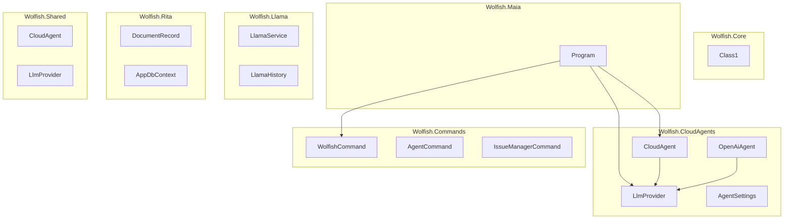

# SPECIFICATION.md

## 1. Project Overview
WolfishTools is a collection of .NET 10 based CLI tools and services for automation, AI assistance, and system management on Linux. The main entry points are the `maia` CLI (Wolfish.Maia) and various cloud agents (Wolfish.CloudAgents) that interact with LLM providers (Gemini, Llama, etc.).

## 2. Architecture Diagram


## 3. Sub‑Projects / Namespaces
| Folder | Description |
|--------|-------------|
| `Wolfish.Core` | Minimal core library (placeholder class). |
| `Wolfish.Maia` | CLI assistant (`maia`) that parses commands, loads `cloudagents.json`, and forwards queries to LLM providers. |
| `Wolfish.CloudAgents` | Types that model cloud agents, LLM providers, and configuration utilities. |
| `Wolfish.Commands` | Helper classes for terminal command definitions (`TerminalCommand.json`), issue management, and generic command wrappers. |
| `Wolfish.Llama` | Service and history handling for Llama models. |
| `Wolfish.Rita` | Simple document storage with EF Core (`DocumentRecord`, `AppDbContext`). |
| `Wolfish.Shared` | Shared abstractions used across projects (duplicate of CloudAgents for reuse). |
| `Wolfish.Cadu` | Example project with EF Core DbContext (`CaduDbContext`). |
| `Wolfish.Gemini` | Wrapper for Gemini model interactions. |

## 4. Key Classes & Interfaces
### Wolfish.Maia
| Class | Responsibility | Public Methods / Important Members |
|-------|----------------|------------------------------------|
| `Program` | CLI entry point, command dispatch, agent orchestration. | `Main(string[] args)`, `ShowHelp()`, `SearchAgentByName()`, `GetAllAgents()`, `ConfigProvider()` |

### Wolfish.CloudAgents
| Class | Responsibility | Public Methods |
|-------|----------------|----------------|
| `CloudAgent` | Represents an LLM‑backed agent (name, model, provider). | properties only (no methods). |
| `LlmProvider` | Holds provider configuration (endpoint, API key). | properties only. |
| `OpenAiAgent` | Implements `IAgent` to stream messages to OpenAI‑compatible endpoints. | `SendMessageStreamingAsync()` |
| `AgentSettings` | Settings used by agents (history mode, system prompts). |

### Wolfish.Commands
| Class | Responsibility |
|-------|----------------|
| `WolfishCommand` | Loads command definitions from `TerminalCommands.json` and builds a limited table view. |
| `AgentCommand` | Static helper for agent‑related commands. |
| `IssueManagerCommand` | Static utility for creating GitHub issues (contains inner `Issue` class). |
| `TerminalCommandDto` / `StepCommand` | DTOs for terminal command description. |

### Wolfish.Llama
| Class | Responsibility |
|-------|----------------|
| `LlamaService` | Wrapper around Llama model inference. |
| `LlamaHistory` | Static helper for persisting conversation history. |
| `HistoryMessage` | Model for a single message entry. |

### Wolfish.Rita
| Class | Responsibility |
|-------|----------------|
| `DocumentRecord` | Simple POCO representing a stored document. |
| `AppDbContext` | EF Core `DbContext` for Rita storage. |

### Wolfish.Shared (mirrored)
| Class | Responsibility |
|-------|----------------|
| `CloudAgent` | Same as above, shared for other projects. |
| `LlmProvider` | Same as above. |
| `LlamaSettings` | Configuration schema for Llama integration. |

## 5. Command‑Line Interface (Maia)
```
maia welcome                 # Show welcome message
maia list                    # List all available commands
maia platform                # Show OS information
maia directory               # Print base directory
maia help                    # Show this help
maia install <package>       # Install a package
maia uninstall <package>     # Uninstall a package
maia ask <question> [...]    # Send a question to the selected LLM agent
```
All commands are defined in `TerminalCommands.json` (loaded by `WolfishCommand`).

## 6. Configuration Files
| File | Purpose |
|------|---------|
| `cloudagents.json` | Defines all cloud agents (name, model, provider, history mode, system message). |
| `appsettings.json` | Holds LLM provider credentials (`Endpoint`, `ApiKey`). API keys are **not** committed to the repository (they are added locally). |
| `TerminalCommands.json` | JSON list of CLI commands with description, arguments, and examples. |

## 7. Build & Release Process
The repository uses the standard .NET SDK workflow:
1. `dotnet restore`
2. `dotnet build`
3. `dotnet test` (if tests exist)
4. Pack the CLI as a NuGet package: `dotnet pack -c Release`
5. Publish to GitHub Releases (see `README.md`).
The `docs/release-process.md` file lists the acronym‑based release names (RITA, C.A.D.U., etc.).

## 8. Spec‑Driven Development Guidelines
1. **Create a spec** – Add a new markdown file (or update `SPECIFICATION.md`) describing the intended behaviour, public API, and any edge‑cases.
2. **Derive implementation** – Write code that satisfies the spec; keep the spec as the single source of truth.
3. **Validate** – Run unit/integration tests and optionally a script that parses the spec to ensure all headings are present.
4. **Version control** – Commit the spec alongside the implementation. Future changes must update the spec first.
5. **Automation** – A CI step can lint the spec (e.g., check for missing sections) and fail the build if the spec diverges from the code.

## 9. Glossary / Acronyms
- **MAIA** – *Modular AI Assistant* – the main CLI.
- **GEO** – Low‑level kernel interaction module.
- **RITA** – Retrieval of Informational Texts & Archives.
- **C.A.D.U.** – Computational Accelerator for Development and Utilities.
- **LLM** – Large Language Model.
- **MCP** – Model Context Protocol (used for agent communication).

---
*Generated on 2026‑07‑31.*
